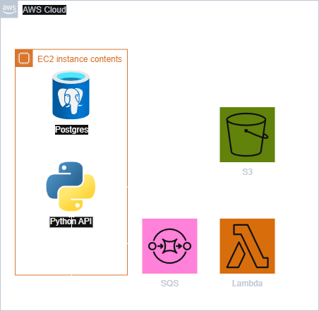

# AWS File Processing Pipeline
A complete end-to-end file upload and processing API using Python, Flask, AWS Lambda, SQS, Secrets Manager, and Terraform — designed for local-first deployment and showcase flexibility.

---
## Features

- Containerized API application
- S3 file storage
- Async Postgres record management, via Celery
- Dynamically process PDFs in Lambda via SQS
- Wired callback from Lambda to Flask API
- AWS Secrets Manager
- Terraform infrastructure as code
- Deployable locally via bash scripts — no CI/CD pipeline required, but can be easily converted
- Swagger UI available for live documentation at `/apidocs`

---
## Architecture Overview

**Repo**
```
├── scripts/
│   ├── deploy_terraform.sh         # Full deploy script
│   ├── destroy_all.sh              # Full destroy script
│   └── user_data.sh                # EC2 bootstrap (installs Docker & runs Flask app)
├── src/
│   └── processing/                 # Lambda function and dependencies
│       ├── lambda_function.py
│       ├── pdf_processor.py
│       └── requirements.txt
├── terraform/
│   ├── main.tf                     # Infra definitions
│   ├── variables.tf                # Input variable declarations
│   └── terraform.tfvars            # Environment-specific values
└── secrets/
    └── processing_secrets.json     # Updated during deploy
```

**Deployment Scripts**
```bash
[dev machine]
└── deploy_terraform.sh
    ├── Zip + package lambda
    ├── terraform init
    ├── terraform apply → create EC2 + SQS
    ├── get outputs (EC2 DNS + SQS URL)
    ├── regenerate secrets file
    └── terraform apply → upload zip, secrets, deploy Lambda, wire everything

[AWS]
└── EC2 instance (user_data.sh)
    └── pulls Docker container + runs Flask app
        └── loads secrets from AWS
            └── can push messages to SQS

SQS → triggers Lambda → processes file → sends POST callback to EC2 URL (Flask)
```

**Flow**



---
## Getting Started

### Prerequisites

- AWS account with IAM permissions to manage EC2, Lambda, S3, Secrets Manager, IAM, and SQS
- Terraform >= 1.0
- Python 3.11
- Docker (for Flask container)

### Required Environment Variables

```bash
AWS_ACCESS_KEY_ID="your-key"
AWS_SECRET_ACCESS_KEY="your-secret"
AWS_REGION="us-east-1"
AWS_S3_BUCKET_NAME="your-s3-bucket-name"
```
You will also need to acquire your EC2 `Default VPC` as well as your `subnet_id` and add them to the `terraform.tfvars`

#### Secrets
The `processing_secrets.json` file is auto-generated during deployment, but you’ll need to supply your AWS keys and bucket name for it to work.

You can either:

Export the values as environment variables (recommended):

```bash
export AWS_ACCESS_KEY_ID="your-access-key"
export AWS_SECRET_ACCESS_KEY="your-secret-key"
export AWS_REGION="us-east-1"
export AWS_S3_BUCKET_NAME="your-s3-bucket-name"
```

Or:
Create a `secrets/processing_secrets.json` manually before first run:

```json
{
  "AWS_ACCESS_KEY_ID": "your-access-key",
  "AWS_SECRET_ACCESS_KEY": "your-secret-key",
  "AWS_REGION": "us-east-1",
  "AWS_S3_BUCKET_NAME": "your-bucket-name",
  "AWS_SQS_QUEUE_URL": "",
  "API_CALLBACK_URL": ""
}
```
The deploy script will automatically update the `AWS_SQS_QUEUE_URL` and `API_CALLBACK_URL` based on your deployed infrastructure.

---
## Usage

### Local

There is `docker-compose` included in the docker directory which will spin up the flask app in a local docker container for testing. This wont have the ability to run the processing lambda, but it can be used for testing the general API functionality with Postgres and file storage. You can view the Swagger for the api as well at `http://localhost:8080/swagger/index.html`

### Deploy

```bash
./scripts/deploy_terraform.sh
```

This will:
- Package Lambda
- Deploy EC2 and SQS
- Generate secrets file
- Upload to AWS Secrets Manager
- Deploy the rest of the stack

### Tear Down

```bash
./scripts/destroy_terraform.sh
```

---
## Testing

1. Hit the Flask API's `/api/files` route with a `multipart/form-data` payload containing:
    - File
    - Metadata (JSON string)
    - Flag: `process=true` with processing params
        
2. Confirm S3 stores the file
3. Check that SQS is triggered
4. Lambda processes the file (e.g. splits PDF)
5. Lambda POSTs back to `/api/records/` with new entries

#### Example Curl

```bash
curl -X POST http://<EC2_PUBLIC_IP>:8000/api/files/ \
  -F "file=@sample.pdf" \
  -F 'metadata={
        "file_name": "sample.pdf",
        "folder_name": "uploads",
        "description": "Split this doc",
        "tags": ["example", "test"],
        "process": true,
        "process_params": {
          "split_params": {
            "file_map": [
              {"pages": [0, 1]},
              {"pages": [2]}
            ]
          },
          "prefix": "split",
          "suffix": "2024"
        }
      }'
```
(Note: Wrap `metadata` with single quotes and escape newlines or pass as a compact JSON string.)

---

## Potential Enhancements

- Expand Processing Lambda to include information retrieval using OCR and NLP
- Add GitHub Actions for CI/CD
- Use ECR image builds instead of Dockerfile-from-git
- Upload Lambda via container image instead of zip
    

